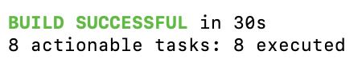

# Gradle practical tasks

## 1. Install required software locally (latest version of Gradle, Java).

Done.

---

## 2. ​​Go to https://github.com/spring-projects/spring-petclinic, fork it, and clone the forked repo.

Done.

--

## 3. Check what tasks are available for the project.

**Command:**

```bash
./gradlew tasks
```

**Result:**

<p align="center">  </p>

---

## 4. Run all available project tests.

**Command:**

```bash
./gradlew test
```

**Result (got an error - it seems Gradle can't find Java 17 on the machine):**

<p align="center">  </p>

On the system had Java 21 installed, so the fix was updating the Java version in `build.gradle`:

```java
java {
  toolchain {
    languageVersion = JavaLanguageVersion.of(21)
  }
}
```

<p align="center">  </p>

---

## 5. Build the project and run it, and verify it’s available on the localhost in the browser.

**Command:**

```bash
./gradlew build
```

**Result:**

<p align="center">  </p>

To run project we can use two commands: `run` or `bootRun`. The difference is that `bootRun` is a Gradle task provided by the Spring Boot Gradle plugin (includes all dependencies and Spring Boot features, loads Spring Boot’s embedded server), however `run` task does not include Spring Boot-specific setup and will not start the embedded Tomcat server properly.

**Command:**

```bash
./gradlew bootRun
```
**Result:**

<p align="center">  </p>

---

## 6. Perform the cleanup.

**Command:**

```bash
./gradlew clean
```
**Result:**

After cleanup, the application is no longer available in the browser.

---

## 7. Explore gradle-related files. Identify which gradle file defines the project name and change it. Build the project again and verify the new project name is being used (you need to find .jar files).

The project name is defined in `settings.gradle`:

```
rootProject.name = 'spring-petclinic'
```

After changing the name and rebuilding the project, Gradle creates a `.jar` file using the new project name:

<p align="center">  </p>

---

## 8. Create an additional custom task, which depends on the build task (so by calling this task the build and test tasks will also be executed). It should open the browser with generated test results.

In the `build.gradle` paste this task definition:

```
task testReport(dependsOn: build) {
  doLast {
    def testReportUrl = "file://${project.buildDir}/reports/tests/test/index.html"
    exec { commandLine "open", testReportUrl }
  }
}
```

* `doLast` -  the action to perform after the build finishes 
* `file://` — this scheme tells that it’s a local file, not an HTTP/HTTPS URL

**Result:**

<p align="center">  </p>

---

## 9. Add the dynamic versioning to your project using the commonly used axion-release-plugin (GitHub - allegro/axion-release-plugin: Gradle release & version management plugin.). Check the Version your project (Gradle best practice tip #5) to find the tutorial on how to do this.

To check the version, inspect the generated `.jar` file — e.g., `grid-petclinic-3.5.0.jar`.

You *can* hardcode the version in `build.gradle`:

```
version = "0.1.0"
```

But this is not ideal. Instead, use the [Axion Release Plugin](https://github.com/allegro/axion-release-plugin):

```
plugins {
  ...

  id 'pl.allegro.tech.build.axion-release' version '1.13.2'
}

...

version = scmVersion.version

...
```

---

## 10. Check the new available commands after the plugin addition. Using these new commands, check the current project version. Then add and commit some changes to the project and make the project release. Check the current version one more time and git tags available. Note the difference between SNAPSHOT and release versions.

After that some additional tasks will appear, like `currentVersion`:

<p align="center">  </p>

Encountered an SSH athorization error:

<p align="center">  </p>

Hmm, SSH key worked fine before. Why it's not authorized?
After some research I found that this could be a plugin-related bug:

https://github.com/allegro/axion-release-plugin/issues/270

---

## 11. Perform the cleanup.


**Command:**

```bash
./gradlew clean
```
